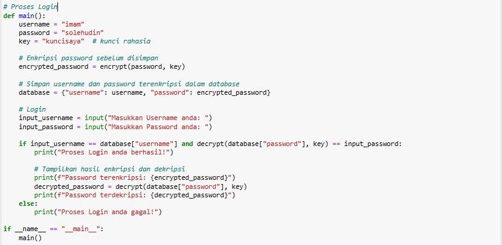
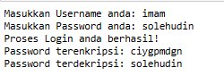
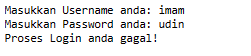

# Tugas-Kriptografi-VIgenere-Chipper

# Nama : Imam Solehudin
# Nim : 312110290

1. dibawah ini merupakan program untuk mengenkripsi dan dekripsi password yang akan kita gunakan.
   

2. Proses login ini saya program dengan cara memasukan langsung user, password dan kunci rahasia yang akan kita gunakan untuk login.

3. Hasil Program sukses login 

4. Hasil Program gagal login

